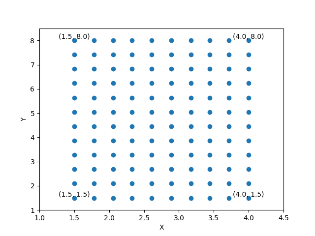

# Fetch Rewards Machine Learning

This program calculates pixel coordinate values for an image that 
is to be displayed on a two dimensional surface given the dimensions 
of the image and the corner points of the image as it is to be displayed.

<br />

The following routes are defined:
- GET `/points` - takes in tuple of dimensions and list of corner point coordinates and
returns the x and y coordinates at which to plot each 
pixel in the input image such that the pixels are evenly spaced within 
the rectangle defined by the corner points
- GET `/plot` - takes in tuple of dimensions and list of corner point coordinates and
returns a visualization the plotted pixels where the corner pixels are annotated

### Getting started
Install [Docker](https://docs.docker.com/get-docker/)

To run the server for the first time, run
```
bash start.sh
```

If this isn't your first time running the server, use the following command to start
```
docker start fetchml
```
and the following command to stop
```
docker stop fetchml
```

### REST API

#### Coordinate points endpoint GET request
```
curl --location --request GET 'http://127.0.0.1:5000/points' \
--header 'Content-Type: application/json' \
--data-raw '{"dimensions": "(10, 12)", "corner_points": "[(1.5, 1.5), (4.0, 1.5), (1.5, 8.0), (4.0, 8.0)]"}'
```

Expected response:
`[
    [
        [
            1.5,
            1.5
        ],
        [
            1.78,
            1.5
        ],
        [
            2.06,
            1.5
        ],
        [
            2.33,
            1.5
        ],
        [
            2.61,
            1.5
        ],
        [
            2.89,
            1.5
        ],
        [
            3.17,
            1.5
        ],
        [
            3.44,
            1.5
        ],
        [
            3.72,
            1.5
        ],
        [
            4.0,
            1.5
        ],
        [
            1.5,
            2.09
        ],
        [
            1.78,
            2.09
        ]
    ],
    [
        [
            2.06,
            2.09
        ],
        [
            2.33,
            2.09
        ],
        [
            2.61,
            2.09
        ],
        [
            2.89,
            2.09
        ],
        [
            3.17,
            2.09
        ],
        [
            3.44,
            2.09
        ],
        [
            3.72,
            2.09
        ],
        [
            4.0,
            2.09
        ],
        [
            1.5,
            2.68
        ],
        [
            1.78,
            2.68
        ],
        [
            2.06,
            2.68
        ],
        [
            2.33,
            2.68
        ]
    ],
    [
        [
            2.61,
            2.68
        ],
        [
            2.89,
            2.68
        ],
        [
            3.17,
            2.68
        ],
        [
            3.44,
            2.68
        ],
        [
            3.72,
            2.68
        ],
        [
            4.0,
            2.68
        ],
        [
            1.5,
            3.27
        ],
        [
            1.78,
            3.27
        ],
        [
            2.06,
            3.27
        ],
        [
            2.33,
            3.27
        ],
        [
            2.61,
            3.27
        ],
        [
            2.89,
            3.27
        ]
    ],
    [
        [
            3.17,
            3.27
        ],
        [
            3.44,
            3.27
        ],
        [
            3.72,
            3.27
        ],
        [
            4.0,
            3.27
        ],
        [
            1.5,
            3.86
        ],
        [
            1.78,
            3.86
        ],
        [
            2.06,
            3.86
        ],
        [
            2.33,
            3.86
        ],
        [
            2.61,
            3.86
        ],
        [
            2.89,
            3.86
        ],
        [
            3.17,
            3.86
        ],
        [
            3.44,
            3.86
        ]
    ],
    [
        [
            3.72,
            3.86
        ],
        [
            4.0,
            3.86
        ],
        [
            1.5,
            4.45
        ],
        [
            1.78,
            4.45
        ],
        [
            2.06,
            4.45
        ],
        [
            2.33,
            4.45
        ],
        [
            2.61,
            4.45
        ],
        [
            2.89,
            4.45
        ],
        [
            3.17,
            4.45
        ],
        [
            3.44,
            4.45
        ],
        [
            3.72,
            4.45
        ],
        [
            4.0,
            4.45
        ]
    ],
    [
        [
            1.5,
            5.05
        ],
        [
            1.78,
            5.05
        ],
        [
            2.06,
            5.05
        ],
        [
            2.33,
            5.05
        ],
        [
            2.61,
            5.05
        ],
        [
            2.89,
            5.05
        ],
        [
            3.17,
            5.05
        ],
        [
            3.44,
            5.05
        ],
        [
            3.72,
            5.05
        ],
        [
            4.0,
            5.05
        ],
        [
            1.5,
            5.64
        ],
        [
            1.78,
            5.64
        ]
    ],
    [
        [
            2.06,
            5.64
        ],
        [
            2.33,
            5.64
        ],
        [
            2.61,
            5.64
        ],
        [
            2.89,
            5.64
        ],
        [
            3.17,
            5.64
        ],
        [
            3.44,
            5.64
        ],
        [
            3.72,
            5.64
        ],
        [
            4.0,
            5.64
        ],
        [
            1.5,
            6.23
        ],
        [
            1.78,
            6.23
        ],
        [
            2.06,
            6.23
        ],
        [
            2.33,
            6.23
        ]
    ],
    [
        [
            2.61,
            6.23
        ],
        [
            2.89,
            6.23
        ],
        [
            3.17,
            6.23
        ],
        [
            3.44,
            6.23
        ],
        [
            3.72,
            6.23
        ],
        [
            4.0,
            6.23
        ],
        [
            1.5,
            6.82
        ],
        [
            1.78,
            6.82
        ],
        [
            2.06,
            6.82
        ],
        [
            2.33,
            6.82
        ],
        [
            2.61,
            6.82
        ],
        [
            2.89,
            6.82
        ]
    ],
    [
        [
            3.17,
            6.82
        ],
        [
            3.44,
            6.82
        ],
        [
            3.72,
            6.82
        ],
        [
            4.0,
            6.82
        ],
        [
            1.5,
            7.41
        ],
        [
            1.78,
            7.41
        ],
        [
            2.06,
            7.41
        ],
        [
            2.33,
            7.41
        ],
        [
            2.61,
            7.41
        ],
        [
            2.89,
            7.41
        ],
        [
            3.17,
            7.41
        ],
        [
            3.44,
            7.41
        ]
    ],
    [
        [
            3.72,
            7.41
        ],
        [
            4.0,
            7.41
        ],
        [
            1.5,
            8.0
        ],
        [
            1.78,
            8.0
        ],
        [
            2.06,
            8.0
        ],
        [
            2.33,
            8.0
        ],
        [
            2.61,
            8.0
        ],
        [
            2.89,
            8.0
        ],
        [
            3.17,
            8.0
        ],
        [
            3.44,
            8.0
        ],
        [
            3.72,
            8.0
        ],
        [
            4.0,
            8.0
        ]
    ]
]`

#### Plot points endpoint GET request (plot viewable in Postman)
```
curl --location --request GET 'http://127.0.0.1:5000/plot' \
--header 'Content-Type: application/json' \
--data-raw '{"dimensions": "(10, 12)", "corner_points": "[(1.5, 1.5), (4.0, 1.5), (1.5, 8.0), (4.0, 8.0)]"}'
```

Expected response (viewable in Postman):


### Test
To run test cases:
```
pytest -v test.py
```
